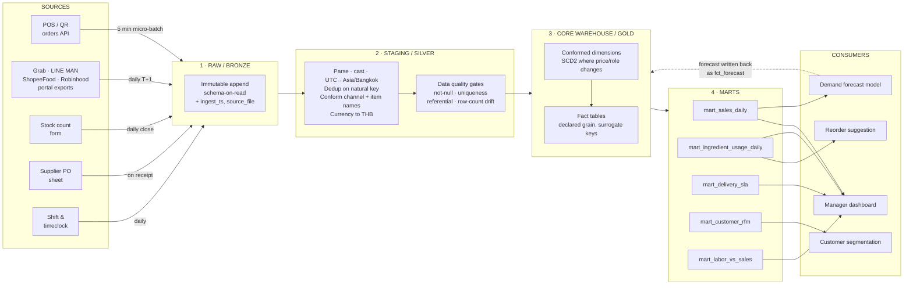
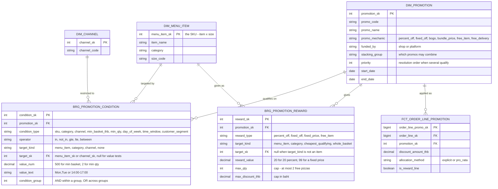
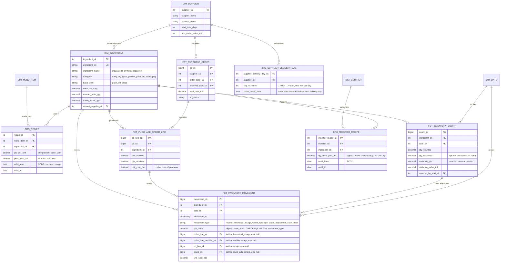
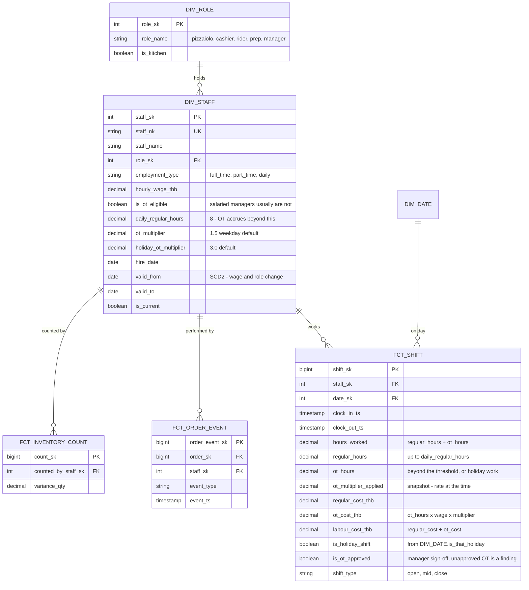

# Pizza Shop Data Platform — Pipeline & ER Model

Class project. Data platform design for a single-location, owner-operated pizza shop in Bangkok
selling across QR dine-in, phone, and four delivery aggregators.

This repository is the full write-up: how data gets from five source systems into a warehouse, the
ER model at each layer, and the decisions worth defending in a review.

## Files

| File | What it is |
|---|---|
| `README.md` | This document — the full write-up, with all five diagrams inline |
| `docs/data-platform.html` | Styled web version of the same write-up |
| `diagrams/01-pipeline-flow.mmd` | Source → raw → staging → core → mart → consumer flow |
| `diagrams/02-er-sales-orders.mmd` | ER: orders, lines, payments, promotions, channels, customers |
| `diagrams/03-er-inventory-supply.mmd` | ER: ingredients, recipes, stock movements, suppliers, POs |
| `diagrams/04-er-people-shifts.mmd` | ER: staff, roles, shifts, overtime |
| `diagrams/05-er-promotions.mmd` | ER: promotion conditions and rewards |
| `renders/*.jpg` | All five diagrams exported as JPG, 2352px wide, for slides |

**Reading it.** The diagrams below render directly on GitHub, and in VS Code (Markdown Preview),
Obsidian, Typora and Notion. For the styled version, clone the repo and open
`docs/data-platform.html` in a browser — GitHub shows `.html` as raw source, so that file only
works locally, and it needs an internet connection on first load because it pulls Mermaid from a
CDN. Ready-made JPGs are in `renders/`; the `.mmd` files also paste straight into
[mermaid.live](https://mermaid.live) if you need a different size or format.

---

## 1 · Scope and assumptions

One store, so there is no `dim_store` — location is a constant, not a dimension. Everything is
modelled at the grain a single manager can act on: a day, a menu item, a channel, an ingredient,
a shift.

- **Forecast grain is menu item × business day × channel.** The load-bearing assumption: it makes
  the sales mart a daily item-level table rather than revenue-only, which is what makes ingredient
  forecasting possible downstream.
- **Business day ≠ calendar day.** The shop trades past midnight, so a business day runs
  10:00–02:00 Asia/Bangkok. Every fact carries both `order_ts` and `business_date_sk`.
- **Aggregator orders are anonymous.** Grab, LINE MAN, ShopeeFood and Robinhood do not hand over
  customer identity. Membership and segmentation are *own-channel only*.
- **Stock is not "order ±10%".** Consumption is *derived* from a recipe, then *reconciled* against
  physical counts. The 10% is the variance you measure, not a rule you hard-code.

## 2 · Source systems

| Source | What it gives | Format / access | Cadence | Natural key |
|---|---|---|---|---|
| POS / QR ordering | Dine-in and walk-in orders, lines, payments, kitchen status | App DB or POS API | Near real-time (5 min micro-batch) | `pos_order_id` |
| Aggregators ×4 | Platform orders, lines, promo, commission, courier timestamps | Merchant-portal CSV export or partner API | Daily (T+1, some settle T+7) | `(platform, platform_order_id)` |
| Inventory counts | Physical stock on hand by ingredient | Tablet form / Google Sheet | Daily close + weekly full count | `(count_session_id, ingredient_id)` |
| Purchasing | Supplier POs, goods receipts, unit cost | Sheet or supplier invoice entry | On delivery (2–3× / week) | `po_line_id` |
| Staff & shifts | Roster, clock-in/out, role, wage rate | Scheduling app / sheet | Daily | `(staff_id, shift_start)` |

> **Why this matters:** POS is streaming-ish and trustworthy; aggregator data is late, batched,
> schema-drifting, and arrives once per platform with four different column names for "order total".
> Nothing downstream of staging should care which of the five it came from — that is the entire job
> of the conform layer.

## 3 · Pipeline architecture

### Layer contracts

| Layer | Guarantee | Deliberately not done here |
|---|---|---|
| 1 · Raw | Nothing is ever lost or edited. Every row keeps `source_system`, `ingest_ts`, `source_file`, raw payload. | No typing, no dedup, no joins. |
| 2 · Staging | One row per real-world event. Types cast, timestamps in Asia/Bangkok, channel and item names conformed, duplicates removed. | No business aggregation, no KPI logic. |
| 3 · Core | Star schema. Every fact has a declared grain and only surrogate keys. History preserved via SCD2. | No presentation shaping, no channel-specific hacks. |
| 4 · Mart | One table per question, pre-aggregated, dashboard- and model-ready. | No re-derivation of business rules — those live in core. |

## 4 · ER model — sales and orders

Grain declarations:

- `FCT_ORDER` — one row per order (any channel)
- `FCT_ORDER_LINE` — one row per menu item per order
- `FCT_ORDER_EVENT` — one row per status transition per order
- `FCT_PAYMENT` — one row per tender per order (split payments are normal)
- `FCT_ORDER_LINE_MODIFIER` — one row per modifier per order line

```mermaid
erDiagram
  DIM_DATE ||--o{ FCT_ORDER : "business day"
  DIM_CHANNEL ||--o{ FCT_ORDER : "sold via"
  DIM_CUSTOMER ||--o{ FCT_ORDER : "placed by (own channels only)"
  FCT_ORDER ||--|{ FCT_ORDER_LINE : contains
  FCT_ORDER ||--o{ FCT_ORDER_EVENT : "tracked by"
  FCT_ORDER ||--|{ FCT_PAYMENT : "settled by"
  FCT_ORDER ||--o{ FCT_ORDER_PROMOTION : "discounted by (basket-level)"
  DIM_PROMOTION ||--o{ FCT_ORDER_PROMOTION : applied
  FCT_ORDER_LINE ||--o{ FCT_ORDER_LINE_PROMOTION : "discounted by (SKU-level)"
  DIM_PROMOTION ||--o{ FCT_ORDER_LINE_PROMOTION : applied
  DIM_MENU_ITEM ||--o{ FCT_ORDER_LINE : "item sold"
  DIM_MENU_ITEM ||--o{ BRG_CHANNEL_MENU_ITEM : "listed as"
  DIM_CHANNEL ||--o{ BRG_CHANNEL_MENU_ITEM : "lists"
  FCT_ORDER_LINE ||--o{ FCT_ORDER_LINE_MODIFIER : "customised by"
  DIM_MODIFIER ||--o{ FCT_ORDER_LINE_MODIFIER : "applied as"
  DIM_STAFF ||--o{ FCT_ORDER_EVENT : "performed by"

  DIM_DATE {
    int date_sk PK
    date calendar_date
    int day_of_week
    boolean is_weekend
    boolean is_thai_holiday
    string month_name
  }
  DIM_CHANNEL {
    int channel_sk PK
    string channel_code UK "QR_DINEIN, GRAB, LINEMAN, SHOPEE, ROBINHOOD, PHONE"
    string channel_type "dine_in or delivery"
    boolean is_own_channel
    decimal commission_rate_pct
  }
  DIM_CUSTOMER {
    int customer_sk PK
    string customer_nk UK "membership or phone hash"
    date first_order_date
    string signup_source
    boolean is_member
  }
  DIM_MENU_ITEM {
    int menu_item_sk PK
    string menu_item_nk "stable business key"
    string item_name
    string category "pizza, chicken, side, drink"
    string size_code
    decimal base_price_thb
    date valid_from "SCD2"
    date valid_to "SCD2"
    boolean is_current
  }
  BRG_CHANNEL_MENU_ITEM {
    int channel_menu_sk PK
    int channel_sk FK
    int menu_item_sk FK
    string platform_item_id "aggregator's own id"
    decimal channel_price_thb "uplifted platform price"
    boolean is_listed
  }
  DIM_PROMOTION {
    int promotion_sk PK
    string promo_code
    string promo_name
    string promo_mechanic "percent_off, fixed_off, bogo, bundle_price, free_item, free_delivery"
    string funded_by "shop or platform"
    string stacking_group "which promos may combine"
    int priority "resolution order when several qualify"
    date start_date
    date end_date
  }
  FCT_ORDER {
    bigint order_sk PK
    string external_order_id "platform natural key"
    int channel_sk FK
    int date_sk FK
    int customer_sk FK "null for aggregator orders"
    timestamp order_ts
    decimal gross_amount_thb
    decimal discount_amount_thb
    decimal delivery_fee_thb
    decimal commission_amount_thb
    decimal net_revenue_thb
    string order_status
    boolean is_cancelled
  }
  FCT_ORDER_LINE {
    bigint order_line_sk PK
    bigint order_sk FK
    int menu_item_sk FK
    int quantity
    decimal unit_price_thb "price at time of order"
    decimal line_discount_thb
    decimal line_net_thb
  }
  DIM_MODIFIER {
    int modifier_sk PK
    string modifier_nk UK
    string modifier_name "extra cheese, no chili, thin crust"
    string modifier_type "add, remove, substitute"
    string applies_to_category "pizza, chicken, drink"
    decimal default_price_delta_thb
    boolean is_active
  }
  FCT_ORDER_LINE_MODIFIER {
    bigint order_line_modifier_sk PK
    bigint order_line_sk FK
    int modifier_sk FK
    int quantity "double extra cheese is qty 2"
    decimal price_delta_thb "snapshot, not joined"
  }
  FCT_ORDER_EVENT {
    bigint order_event_sk PK
    bigint order_sk FK
    string event_type "placed, accepted, prep_start, prep_complete, courier_pickup, delivered, cancelled"
    timestamp event_ts
    int staff_sk FK
    int duration_from_prev_sec
  }
  FCT_PAYMENT {
    bigint payment_sk PK
    bigint order_sk FK
    string tender_type "cash, promptpay_qr, card, platform_settled"
    decimal amount_thb
    timestamp paid_ts
    date settlement_date "platform payouts lag"
  }
  FCT_ORDER_PROMOTION {
    bigint order_promo_sk PK
    bigint order_sk FK
    int promotion_sk FK
    decimal discount_amount_thb "basket-level total"
  }
  FCT_ORDER_LINE_PROMOTION {
    bigint order_line_promo_sk PK
    bigint order_line_sk FK "the SKU-level grain"
    bigint order_sk FK "degenerate, saves a join"
    int promotion_sk FK
    decimal discount_amount_thb "allocated to this line"
    string allocation_method "explicit or pro_rata"
    boolean is_reward_line "true if this line IS the free item"
  }
```

`BRG_CHANNEL_MENU_ITEM` is what lets a Grab listing and a QR listing of the same pizza roll up to
one item.

### Modifiers are rows, not JSON

`FCT_ORDER_LINE` used to carry `modifiers_json` — a string holding `"extra cheese, no chili"`. That
is a repeating group hidden inside a column, so no query can total extra-cheese sales without
string matching. But the expensive part is not reporting, it is **inventory**.

Theoretical usage is derived as `FCT_ORDER_LINE × BRG_RECIPE`, and `BRG_RECIPE` explodes a *menu
item*. Extra cheese is roughly 40 g of mozzarella that no recipe knows about — physically consumed,
never counted as usage, and therefore landing in variance as unexplained shrinkage. A JSON blob
quietly corrupts the exact number this whole model exists to produce (section 1: "the 10% is the
variance you measure").

So modifiers get the same treatment as anything else that moves stock:

- `DIM_MODIFIER` — the catalogue, with `modifier_type` (add / remove / substitute)
- `FCT_ORDER_LINE_MODIFIER` — grain: order line × modifier, with `price_delta_thb` snapshotted
- `BRG_MODIFIER_RECIPE` (figure 3) — what a modifier consumes, **signed**: extra cheese `+40 g`,
  no chili `−5 g`

Theoretical usage becomes the sum of two explosions rather than one. Without the third table the
first two are just tidier reporting; with it, the variance number is finally honest.

### Promotions: what it looked like, and what changed

The original model attached promotions to the **order** only — `FCT_ORDER_PROMOTION` carried one
`discount_amount_thb` per order per promotion, and `DIM_PROMOTION.promo_type` held a label like
`bogo`. Three things were impossible:

- **Item margin after discount.** A 100 THB discount on a 600 THB basket sat at basket level, so no
  line knew it had been discounted. Food cost % and menu engineering were computed against
  undiscounted revenue — i.e. wrong for exactly the items being promoted.
- **`bogo` had no object.** The label said "buy one get one" and nothing said *of what*.
- **No condition could be expressed.** "20% off pizzas over 500 THB, weekdays, own channels only"
  had nowhere to live except a human's memory.

The fix separates two things that were being conflated:

| | Question it answers | Table |
|---|---|---|
| **Definition** | What *is* this promotion — what qualifies, what do you get? | `BRG_PROMOTION_CONDITION` + `BRG_PROMOTION_REWARD` |
| **Application** | What did it actually *do* to this basket? | `FCT_ORDER_LINE_PROMOTION` |

**By SKU.** `DIM_MENU_ITEM` is already at SKU grain — it carries `size_code`, so "Hawaiian M" and
"Hawaiian L" are separate rows with separate `menu_item_sk`. Targeting by SKU therefore needs no new
dimension; it needs a *reference* to one. `FCT_ORDER_LINE_PROMOTION` is grained at order line ×
promotion, which is the SKU-level answer: every discounted baht is attributable to one sold SKU.

**By condition.** Conditions become **rows, not columns**. Each row is one test —
`condition_type` (sku, category, channel, min_basket_thb, min_qty, day_of_week, time_window,
customer_segment), an `operator`, and either a `target_sk` pointing at an item or channel, or a
plain `value_num`. Rows sharing a `condition_group` are ANDed; separate groups are ORed. Rewards
work the same way, with caps (`max_qty`, `max_discount_thb`) so an open-ended promo cannot run away.

This is what keeps a new mechanic from becoming a schema change. "Buy 2 pizzas, get the cheapest
garlic bread free, Mon–Thu, dine-in only" is four condition rows and one reward row — no new column.

## 5 · ER model — promotion rules

Grain declarations:

- `BRG_PROMOTION_CONDITION` — one row per condition per promotion
- `BRG_PROMOTION_REWARD` — one row per reward per promotion
- `FCT_ORDER_LINE_PROMOTION` — one row per order line per promotion

**Two rules the pipeline has to enforce**, because the schema alone cannot:

1. **Order-level discounts are allocated down to lines.** Free delivery and basket-level percent-off
   have no natural line, so staging spreads them pro-rata across qualifying lines and stamps
   `allocation_method = 'pro_rata'`. Without this, item margin stays fiction.
2. **The two facts must reconcile.** For any order,
   `SUM(FCT_ORDER_LINE_PROMOTION.discount) = SUM(FCT_ORDER_PROMOTION.discount)`. That equality is a
   data quality test, not a hope — it is the only thing standing between allocated discount and
   quietly invented revenue.

## 6 · ER model — inventory and supply

Theoretical usage flows in from `FCT_ORDER_LINE` via `BRG_RECIPE` **and** from
`FCT_ORDER_LINE_MODIFIER` via `BRG_MODIFIER_RECIPE`; physical truth flows in from
`FCT_INVENTORY_COUNT`; the gap between them is the number the manager gets paid to shrink.

### Delivery days are a table, not a string

`DIM_SUPPLIER.delivery_days` used to hold `"Mon,Thu"`. Same defect as `modifiers_json` — a list
crammed into a scalar — and it breaks something specific. The closed loop in section 9 says the
reorder suggestion respects `lead_time_days` **and** `delivery_days`; you cannot compute "the next
delivery date after today" from a comma-separated string without parsing text in SQL, and "which
suppliers deliver on Tuesday" is not answerable at all.

`BRG_SUPPLIER_DELIVERY_DAY` is one row per supplier per weekday. It also carries
`order_cutoff_time`, because "order by 16:00 or it ships the following delivery day" moves the
recommended order date by a full day — and that date is the thing the manager acts on.

### One reference column became four

`FCT_INVENTORY_MOVEMENT.source_ref_sk` was a single `bigint` documented as "order_line_sk or
po_line_sk". That is a **polymorphic foreign key**, and it is the most dangerous construct in the
model:

- the database cannot declare a foreign key on it, so integrity is whatever the ETL remembers to do;
- the two key spaces overlap, so joining a `po_line_sk` to `FCT_ORDER_LINE` does not raise an
  error — it returns the **wrong rows**, silently.

It is now four explicit nullable foreign keys — `order_line_sk`, `order_line_modifier_sk`,
`po_line_sk`, `count_sk` — with a CHECK that at most one is set and that it agrees with
`movement_type`. Rows for `waste`, `spoilage` and `staff_meal` legitimately have all four null;
those movements have no source document.

The tempting alternative is a `ref_table` + `ref_id` pair of strings. It is more flexible, and it is
the wrong trade here: it permanently gives up database-enforced referential integrity, which is the
one thing the split was for. `qty_delta` stays a single signed `decimal` for the same reason it
always was — stock on hand is `SUM(qty_delta)`, one expression with no term to forget — and the
guard against a receipt booked as an outflow is a CHECK tying sign to `movement_type`, not a second
column.

## 7 · ER model — people and shifts

Staff data only earns its place if it joins to something. Here it joins twice: to shifts (labour
cost per hour) and to order events (who was on the pass when tickets ran late).

### Overtime

`hours_worked` alone cannot cost a shift, because not every hour costs the same. OT is split out
into its own measures rather than folded into a single number:

- **`regular_hours` and `ot_hours` are separate columns on `FCT_SHIFT`.** Labour cost % is
  meaningless if a 1.5× hour is counted as a 1.0× hour, and "how much OT did we burn last month"
  is a question the manager will ask before any other labour question.
- **`ot_multiplier_applied` is snapshotted onto the fact.** Same argument as `unit_price_thb` on the
  order line: the multiplier is policy, policy changes, and a changed policy must not silently
  rewrite what last quarter's overtime cost. `DIM_STAFF` holds the *current* default
  (`ot_multiplier`, `holiday_ot_multiplier`); the fact holds what was actually used.
- **`is_ot_eligible` sits on `DIM_STAFF`.** Salaried managers typically accrue no OT. Without the
  flag, their long days inflate the OT figure and hide the OT that is real.
- **`is_ot_approved` sits on the fact.** Approved and unapproved overtime cost the same money but
  mean different things — one is a staffing decision, the other is a finding.

**One honest caveat about grain.** OT is legally a *daily* concept (hours beyond the daily
threshold), while `FCT_SHIFT` is grained per shift. If someone works two shifts in one business day,
the threshold spans both, so `regular_hours` / `ot_hours` must be computed at staff × business_date
and then allocated back to shifts — not computed per shift in isolation. The multipliers shown
(1.5× weekday, 3.0× holiday) are the common Thai defaults and should be confirmed against the
Labour Protection Act before anyone runs payroll off this.

## 8 · Modelling decisions worth defending

**01 · Multi-channel order provenance.** Every order carries `channel_sk` plus the platform's own
`external_order_id`. Dedup and idempotent reload both key on **(channel_sk, external_order_id)**,
so re-running yesterday's Grab export cannot double-count revenue.

**02 · Recipe-driven stock, not a fixed percentage.** `BRG_RECIPE` gives grams-per-pizza, so
*theoretical usage* is derived from order lines; `FCT_INVENTORY_COUNT` supplies *actual on-hand*.
Variance = theoretical − actual, and that variance is the waste/shrinkage KPI. The 10% is an output
of the system, not an input to it.

**03 · Price is stored twice, on purpose.** `FCT_ORDER_LINE.unit_price_thb` is an immutable
snapshot — a receipt reprinted in 2027 must show 2026's price. `DIM_MENU_ITEM` is SCD2 so you can
still ask "what did margin look like before the March price rise". Snapshot answers *what
happened*; SCD2 answers *what was true*.

**04 · Membership only exists on own channels.** `FCT_ORDER.customer_sk` is nullable and mostly
null. RFM segmentation is scoped to QR and phone orders and the dashboard must label it that way.
Drawing a customer FK off every order would make the segmentation story fiction.

**05 · Delivery timing is an event log, not columns.** `FCT_ORDER_EVENT` records each transition,
so any duration is a difference between two rows — prep time, pickup wait, total lead time —
without schema changes. Coverage is honestly uneven: QR gives full kitchen granularity, aggregators
typically give accepted/pickup/delivered only.

**06 · Payment, promotion and commission are separate from the order.** Split tenders (half
PromptPay, half cash) need their own rows. Platform-funded vs shop-funded promotions land on
different lines of the P&L. And `commission_amount_thb` is what turns gross revenue into the only
number that matters — net revenue the shop actually banks, which differs by up to 30% between
channels.

**07 · A promotion's definition and its effect are different tables.** Conditions and rewards
(`BRG_PROMOTION_*`) say what the promo *is*; `FCT_ORDER_LINE_PROMOTION` says what it *did*, at SKU
grain. Storing conditions as rows rather than columns is what lets a new mechanic ship without a
migration — and pushing the discount down to the line is what keeps item margin from being fiction.
See section 4.

**08 · Overtime is measured, not averaged.** `regular_hours` and `ot_hours` are separate on
`FCT_SHIFT`, and the multiplier used is snapshotted alongside them. A blended labour rate would be
simpler and would hide the single most controllable cost line the manager has.

**09 · No list lives in a scalar, and no key is polymorphic.** Three fields broke this and all three
were fixed: `modifiers_json`, `DIM_SUPPLIER.delivery_days`, and
`FCT_INVENTORY_MOVEMENT.source_ref_sk`. The first two are 1NF violations that silently disable a
join; the third is worse, because an overloaded key returns wrong rows instead of failing. Sections
4 and 6 argue each one.

## 9 · Marts, dashboard and ML

| Mart | Grain | Built from | Serves |
|---|---|---|---|
| `mart_sales_daily` | business date × channel × menu item | FCT_ORDER + FCT_ORDER_LINE + dims | Sales dashboard; training set for demand forecast |
| `mart_ingredient_usage_daily` | business date × ingredient | FCT_ORDER_LINE × BRG_RECIPE **+** FCT_ORDER_LINE_MODIFIER × BRG_MODIFIER_RECIPE, vs FCT_INVENTORY_COUNT | Waste %, variance alerts, reorder suggestions |
| `mart_delivery_sla` | order | FCT_ORDER_EVENT pivoted to durations | Prep-time and lead-time distributions by channel and hour |
| `mart_customer_rfm` | customer (own channels) | FCT_ORDER where customer_sk not null | Segmentation, win-back campaigns via LINE |
| `mart_labor_vs_sales` | business date × hour | FCT_SHIFT + FCT_ORDER | Labour cost %, OT cost and OT share, understaffed-hour detection |
| `mart_promotion_performance` | promotion × business date × menu item | FCT_ORDER_LINE_PROMOTION × BRG_PROMOTION_REWARD | Discount spend per SKU, incremental units, margin after discount |

### The closed loop

`mart_sales_daily` → forecast units per **item × day × channel** → multiply through `BRG_RECIPE` →
forecast **grams per ingredient** → subtract current on-hand from `FCT_INVENTORY_MOVEMENT`, add
`safety_stock_qty`, respect supplier `lead_time_days` and `BRG_SUPPLIER_DELIVERY_DAY` (including
`order_cutoff_time`) → **a purchase order the manager can approve with one tap.**

Forecasts are written back as `fct_forecast` (grain: item × day × channel × forecast run) so
predicted-vs-actual error is itself a table you can chart. A model you cannot score is a model you
cannot trust.

### Dashboard, top screen

- **Net revenue by channel** — gross minus commission minus shop-funded promos. Almost never what the platform app tells you.
- **Today vs forecast**, live, with the gap called out.
- **Items at risk** — ingredients where projected demand exceeds on-hand before the next delivery day.
- **Variance watch** — ingredients whose theoretical-vs-counted gap breaches its threshold.
- **Prep time p50 / p90 by hour** — where the kitchen breaks, not just that it did.

## 10 · Data quality rules

| Risk | Where it bites | Rule |
|---|---|---|
| Double ingestion | Aggregator export re-downloaded | Merge key `(channel_sk, external_order_id)`; upsert, never append |
| Late-arriving orders | 01:40 order in yesterday's file | Assign `business_date_sk` by 10:00–02:00 window, reprocess a 3-day trailing partition |
| Schema drift | Platform renames a CSV column | Raw layer stores payload as-is; staging fails loudly on unmapped columns rather than silently nulling |
| Unmapped menu item | New platform-only bundle | `BRG_CHANNEL_MENU_ITEM` miss routes to a quarantine table + alert; revenue is never dropped |
| Cancelled / refunded orders | Inflated sales and phantom stock usage | `is_cancelled` excluded from usage derivation; kept in the fact for cancel-rate analysis |
| Recipe changed mid-period | Variance suddenly explodes | `BRG_RECIPE` is SCD2; usage joins on the recipe valid at order time |
| Modifier with no recipe | Extra cheese vanishes into unexplained variance | Alert on any `DIM_MODIFIER` of type `add`/`substitute` with no `BRG_MODIFIER_RECIPE` row |
| Movement pointing at two sources | Wrong-table join returns plausible wrong rows | CHECK at most one of the four source FKs is non-null, and that it matches `movement_type` |
| Supplier with no delivery day | Reorder date cannot be computed, PO never suggested | Reject a `DIM_SUPPLIER` with zero `BRG_SUPPLIER_DELIVERY_DAY` rows |
| Discount allocated but not reconciled | Item margin quietly invented | Assert `SUM(FCT_ORDER_LINE_PROMOTION.discount) = SUM(FCT_ORDER_PROMOTION.discount)` per order; fail the batch, don't warn |
| Promo with no qualifying condition | Discount applies to everything | Reject a `DIM_PROMOTION` row with zero `BRG_PROMOTION_CONDITION` children unless the mechanic is `free_delivery` |
| Overtime split across two shifts | Daily threshold missed, OT under-reported | Compute `regular_hours`/`ot_hours` at staff × business_date, then allocate to shifts |
| OT booked for an ineligible role | Labour cost inflated by salaried managers | Reject `ot_hours > 0` where `DIM_STAFF.is_ot_eligible` is false |
