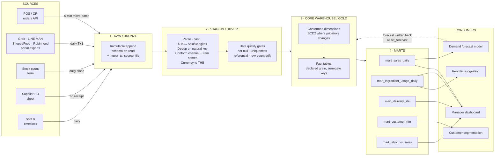
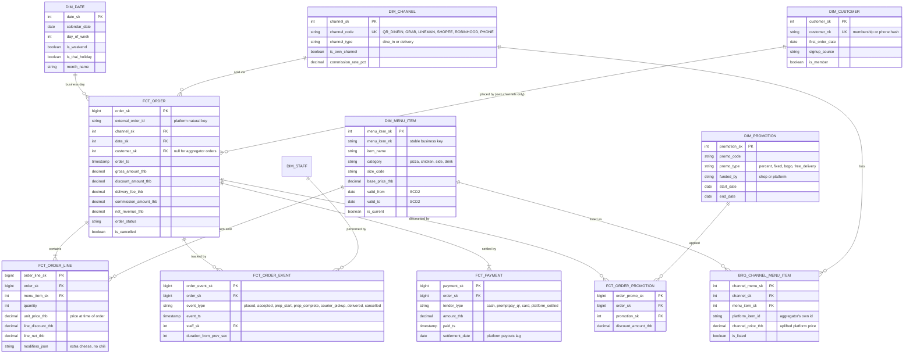
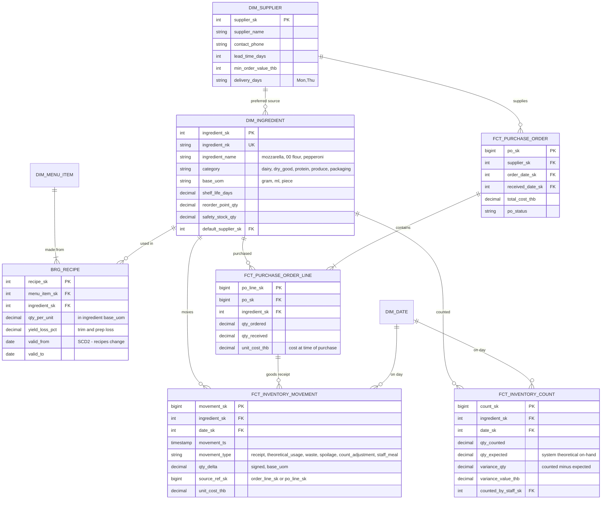
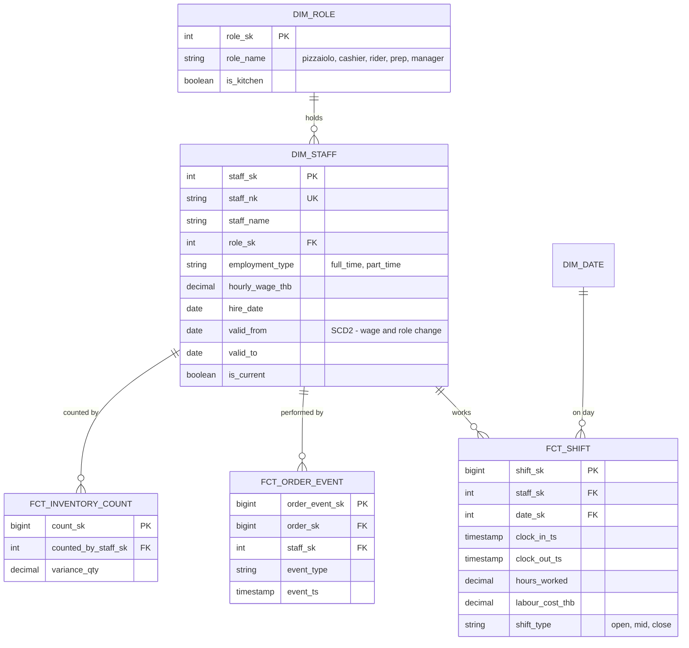

# Pizza Shop Data Platform — Pipeline & ER Model

Class project. Data platform design for a single-location, owner-operated pizza shop in Bangkok
selling across QR dine-in, phone, and four delivery aggregators.

This repository is the full write-up: how data gets from five source systems into a warehouse, the
ER model at each layer, and the decisions worth defending in a review.

## Files

| File | What it is |
|---|---|
| `README.md` | This document — the full write-up, with all four diagrams inline |
| `docs/data-platform.html` | Styled web version of the same write-up |
| `diagrams/01-pipeline-flow.mmd` | Source → raw → staging → core → mart → consumer flow |
| `diagrams/02-er-sales-orders.mmd` | ER: orders, lines, payments, promotions, channels, customers |
| `diagrams/03-er-inventory-supply.mmd` | ER: ingredients, recipes, stock movements, suppliers, POs |
| `diagrams/04-er-people-shifts.mmd` | ER: staff, roles, shifts |

**Reading it.** The diagrams below render directly on GitHub, and in VS Code (Markdown Preview),
Obsidian, Typora and Notion. For the styled version, clone the repo and open
`docs/data-platform.html` in a browser — GitHub shows `.html` as raw source, so that file only
works locally, and it needs an internet connection on first load because it pulls Mermaid from a
CDN. The `.mmd` files paste straight into [mermaid.live](https://mermaid.live) if you need PNG/SVG
exports for slides.

---

## 1 · Scope and assumptions

One store, so there is no `dim_store` — location is a constant, not a dimension. Everything is
modelled at the grain a single manager can act on: a day, a menu item, a channel, an ingredient,
a shift.

- **Forecast grain is menu item × business day × channel.** The load-bearing assumption: it makes
  the sales mart a daily item-level table rather than revenue-only, which is what makes ingredient
  forecasting possible downstream.
- **Business day ≠ calendar day.** The shop trades past midnight, so a business day runs
  10:00–02:00 Asia/Bangkok. Every fact carries both `order_ts` and `business_date_sk`.
- **Aggregator orders are anonymous.** Grab, LINE MAN, ShopeeFood and Robinhood do not hand over
  customer identity. Membership and segmentation are *own-channel only*.
- **Stock is not "order ±10%".** Consumption is *derived* from a recipe, then *reconciled* against
  physical counts. The 10% is the variance you measure, not a rule you hard-code.

## 2 · Source systems

| Source | What it gives | Format / access | Cadence | Natural key |
|---|---|---|---|---|
| POS / QR ordering | Dine-in and walk-in orders, lines, payments, kitchen status | App DB or POS API | Near real-time (5 min micro-batch) | `pos_order_id` |
| Aggregators ×4 | Platform orders, lines, promo, commission, courier timestamps | Merchant-portal CSV export or partner API | Daily (T+1, some settle T+7) | `(platform, platform_order_id)` |
| Inventory counts | Physical stock on hand by ingredient | Tablet form / Google Sheet | Daily close + weekly full count | `(count_session_id, ingredient_id)` |
| Purchasing | Supplier POs, goods receipts, unit cost | Sheet or supplier invoice entry | On delivery (2–3× / week) | `po_line_id` |
| Staff & shifts | Roster, clock-in/out, role, wage rate | Scheduling app / sheet | Daily | `(staff_id, shift_start)` |

> **Why this matters:** POS is streaming-ish and trustworthy; aggregator data is late, batched,
> schema-drifting, and arrives once per platform with four different column names for "order total".
> Nothing downstream of staging should care which of the five it came from — that is the entire job
> of the conform layer.

## 3 · Pipeline architecture

### Layer contracts

| Layer | Guarantee | Deliberately not done here |
|---|---|---|
| 1 · Raw | Nothing is ever lost or edited. Every row keeps `source_system`, `ingest_ts`, `source_file`, raw payload. | No typing, no dedup, no joins. |
| 2 · Staging | One row per real-world event. Types cast, timestamps in Asia/Bangkok, channel and item names conformed, duplicates removed. | No business aggregation, no KPI logic. |
| 3 · Core | Star schema. Every fact has a declared grain and only surrogate keys. History preserved via SCD2. | No presentation shaping, no channel-specific hacks. |
| 4 · Mart | One table per question, pre-aggregated, dashboard- and model-ready. | No re-derivation of business rules — those live in core. |

## 4 · ER model — sales and orders

Grain declarations:

- `FCT_ORDER` — one row per order (any channel)
- `FCT_ORDER_LINE` — one row per menu item per order
- `FCT_ORDER_EVENT` — one row per status transition per order
- `FCT_PAYMENT` — one row per tender per order (split payments are normal)

`BRG_CHANNEL_MENU_ITEM` is what lets a Grab listing and a QR listing of the same pizza roll up to
one item.

## 5 · ER model — inventory and supply

Theoretical usage flows in from `FCT_ORDER_LINE` via `BRG_RECIPE`; physical truth flows in from
`FCT_INVENTORY_COUNT`; the gap between them is the number the manager gets paid to shrink.

## 6 · ER model — people and shifts

Staff data only earns its place if it joins to something. Here it joins twice: to shifts (labour
cost per hour) and to order events (who was on the pass when tickets ran late).

## 7 · Modelling decisions worth defending

**01 · Multi-channel order provenance.** Every order carries `channel_sk` plus the platform's own
`external_order_id`. Dedup and idempotent reload both key on **(channel_sk, external_order_id)**,
so re-running yesterday's Grab export cannot double-count revenue.

**02 · Recipe-driven stock, not a fixed percentage.** `BRG_RECIPE` gives grams-per-pizza, so
*theoretical usage* is derived from order lines; `FCT_INVENTORY_COUNT` supplies *actual on-hand*.
Variance = theoretical − actual, and that variance is the waste/shrinkage KPI. The 10% is an output
of the system, not an input to it.

**03 · Price is stored twice, on purpose.** `FCT_ORDER_LINE.unit_price_thb` is an immutable
snapshot — a receipt reprinted in 2027 must show 2026's price. `DIM_MENU_ITEM` is SCD2 so you can
still ask "what did margin look like before the March price rise". Snapshot answers *what
happened*; SCD2 answers *what was true*.

**04 · Membership only exists on own channels.** `FCT_ORDER.customer_sk` is nullable and mostly
null. RFM segmentation is scoped to QR and phone orders and the dashboard must label it that way.
Drawing a customer FK off every order would make the segmentation story fiction.

**05 · Delivery timing is an event log, not columns.** `FCT_ORDER_EVENT` records each transition,
so any duration is a difference between two rows — prep time, pickup wait, total lead time —
without schema changes. Coverage is honestly uneven: QR gives full kitchen granularity, aggregators
typically give accepted/pickup/delivered only.

**06 · Payment, promotion and commission are separate from the order.** Split tenders (half
PromptPay, half cash) need their own rows. Platform-funded vs shop-funded promotions land on
different lines of the P&L. And `commission_amount_thb` is what turns gross revenue into the only
number that matters — net revenue the shop actually banks, which differs by up to 30% between
channels.

## 8 · Marts, dashboard and ML

| Mart | Grain | Built from | Serves |
|---|---|---|---|
| `mart_sales_daily` | business date × channel × menu item | FCT_ORDER + FCT_ORDER_LINE + dims | Sales dashboard; training set for demand forecast |
| `mart_ingredient_usage_daily` | business date × ingredient | FCT_ORDER_LINE × BRG_RECIPE, vs FCT_INVENTORY_COUNT | Waste %, variance alerts, reorder suggestions |
| `mart_delivery_sla` | order | FCT_ORDER_EVENT pivoted to durations | Prep-time and lead-time distributions by channel and hour |
| `mart_customer_rfm` | customer (own channels) | FCT_ORDER where customer_sk not null | Segmentation, win-back campaigns via LINE |
| `mart_labor_vs_sales` | business date × hour | FCT_SHIFT + FCT_ORDER | Labour cost %, understaffed-hour detection |

### The closed loop

`mart_sales_daily` → forecast units per **item × day × channel** → multiply through `BRG_RECIPE` →
forecast **grams per ingredient** → subtract current on-hand from `FCT_INVENTORY_MOVEMENT`, add
`safety_stock_qty`, respect supplier `lead_time_days` and `delivery_days` → **a purchase order the
manager can approve with one tap.**

Forecasts are written back as `fct_forecast` (grain: item × day × channel × forecast run) so
predicted-vs-actual error is itself a table you can chart. A model you cannot score is a model you
cannot trust.

### Dashboard, top screen

- **Net revenue by channel** — gross minus commission minus shop-funded promos. Almost never what the platform app tells you.
- **Today vs forecast**, live, with the gap called out.
- **Items at risk** — ingredients where projected demand exceeds on-hand before the next delivery day.
- **Variance watch** — ingredients whose theoretical-vs-counted gap breaches its threshold.
- **Prep time p50 / p90 by hour** — where the kitchen breaks, not just that it did.

## 9 · Data quality rules

| Risk | Where it bites | Rule |
|---|---|---|
| Double ingestion | Aggregator export re-downloaded | Merge key `(channel_sk, external_order_id)`; upsert, never append |
| Late-arriving orders | 01:40 order in yesterday's file | Assign `business_date_sk` by 10:00–02:00 window, reprocess a 3-day trailing partition |
| Schema drift | Platform renames a CSV column | Raw layer stores payload as-is; staging fails loudly on unmapped columns rather than silently nulling |
| Unmapped menu item | New platform-only bundle | `BRG_CHANNEL_MENU_ITEM` miss routes to a quarantine table + alert; revenue is never dropped |
| Cancelled / refunded orders | Inflated sales and phantom stock usage | `is_cancelled` excluded from usage derivation; kept in the fact for cancel-rate analysis |
| Recipe changed mid-period | Variance suddenly explodes | `BRG_RECIPE` is SCD2; usage joins on the recipe valid at order time |
